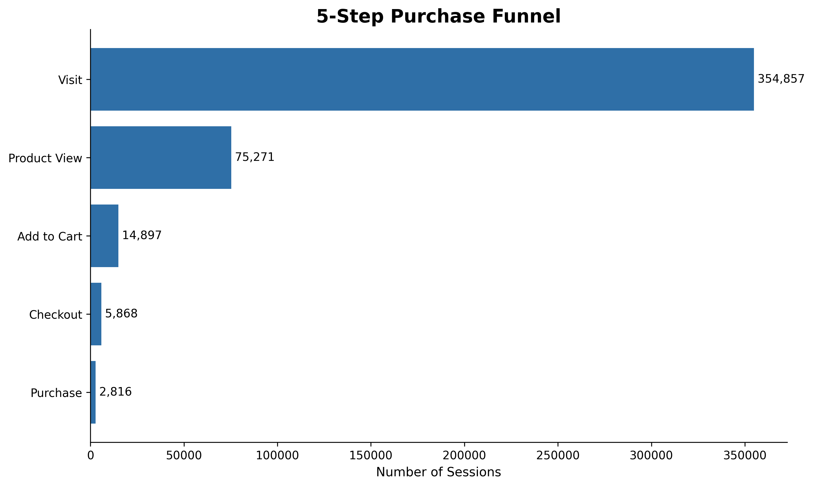
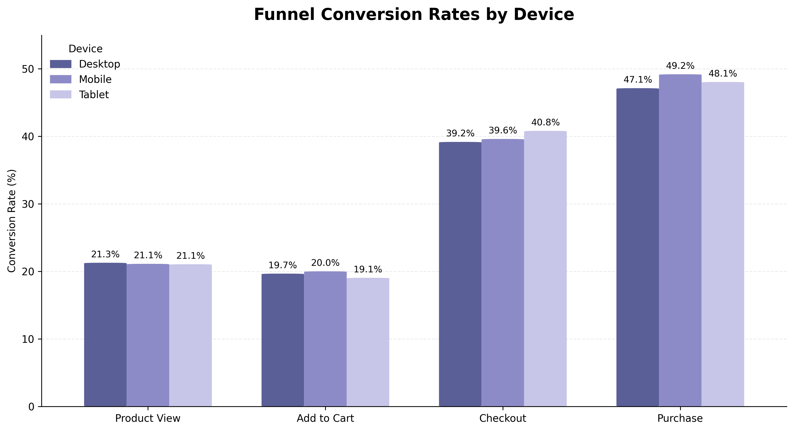
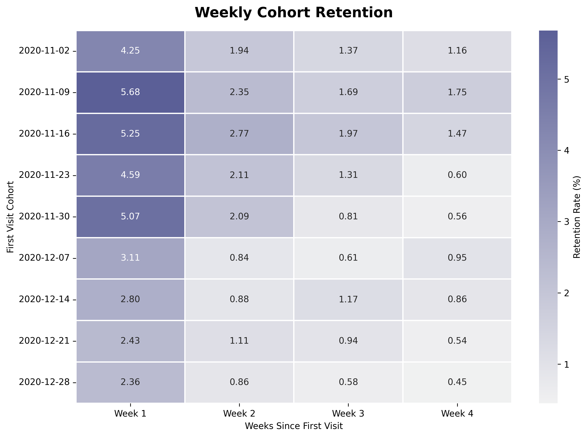
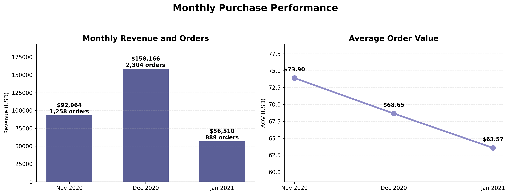
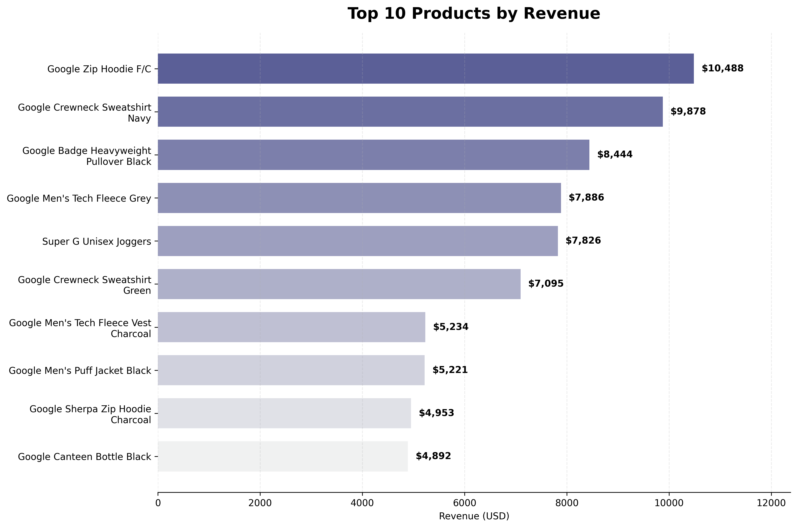
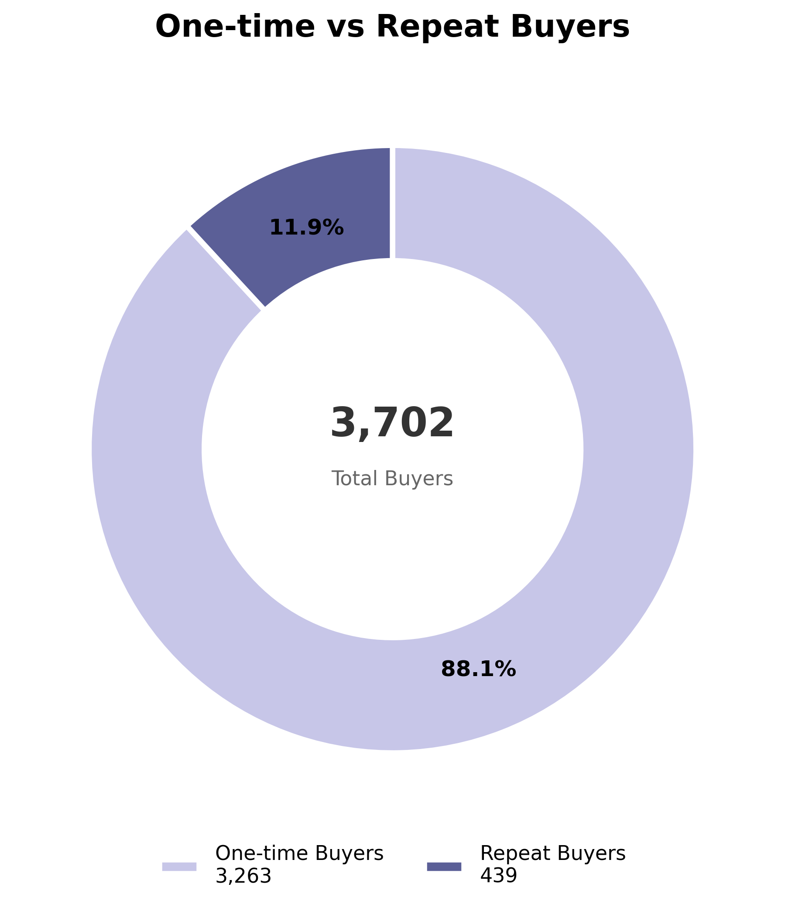
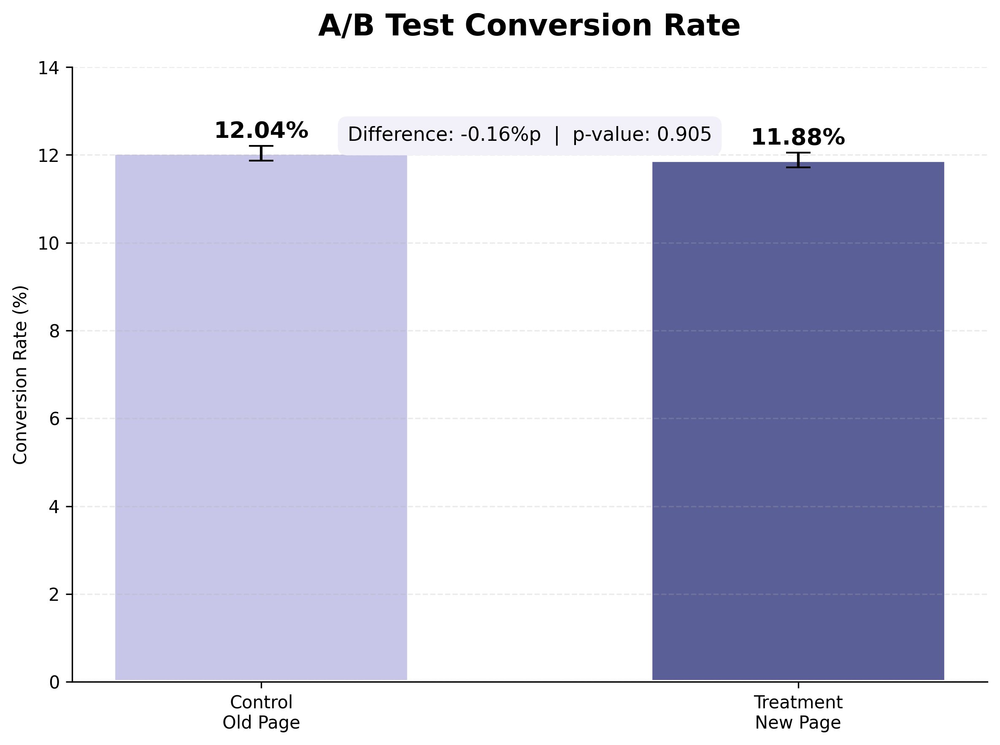

# GA4 이커머스 고객 행동 분석

> 퍼널·코호트 기반 구매 전환 및 리텐션 개선

## 1. 프로젝트 개요

이 프로젝트는 Google Merchandise Store의 GA4 공개 샘플 데이터를 활용하여 사용자의 방문부터 구매까지의 행동을 분석한 개인 프로젝트입니다.

BigQuery SQL로 이벤트 로그를 세션·사용자·거래 단위로 가공하고, 구매 퍼널·코호트 리텐션·디바이스·상품·반복 구매 분석을 통해 주요 이탈 구간과 개선 과제를 도출했습니다.

추가로 별도의 이커머스 랜딩페이지 실험 데이터를 활용하여 전환율 A/B 테스트를 수행했습니다. GA4 분석과 A/B 테스트는 서로 다른 공개 데이터를 사용했으며, A/B 테스트는 통계적 검정 역량을 보여주기 위한 별도 분석입니다.

## 2. 분석 목표

- 방문부터 구매까지 5단계 퍼널의 주요 이탈 구간 파악
- 디바이스별 전환율 차이 확인
- 첫 방문 주차별 재방문율과 초기 이탈 패턴 분석
- 월별 구매 성과와 평균 주문금액 변화 확인
- 매출 기여 상품과 반복 구매 현황 분석
- 별도 실험 데이터를 활용한 전환율 A/B 테스트 수행

## 3. 사용 데이터

### GA4 이커머스 행동 데이터

- 출처: [Google Analytics BigQuery 공개 샘플](https://developers.google.com/analytics/bigquery/web-ecommerce-demo-dataset)
- 테이블: `bigquery-public-data.ga4_obfuscated_sample_ecommerce.events_*`
- 기간: 2020-11-01 ~ 2021-01-31
- 일별 테이블: 92개
- 이벤트: 4,295,584건
- 익명 사용자 식별자: 270,154개

### A/B 테스트 데이터

- 출처: [Udacity A/B 테스트 데이터 공개 미러](https://github.com/30lm32/ml-ab-testing)
- 원본 행: 294,478개
- 분석용 정제 행: 290,584개
- 주요 변수: `user_id`, `timestamp`, `group`, `landing_page`, `converted`

## 4. 사용 기술

- **BigQuery SQL**: GA4 이벤트 로그 조회·검증·집계
- **Python**: pandas, NumPy, Matplotlib, Seaborn
- **통계 분석**: 2표본 비율 Z검정, 95% 신뢰구간
- **분석 환경**: Google BigQuery, Google Colab

## 5. 분석 과정

1. 데이터 기간·이벤트·결측·중복·거래번호·매출 품질검사
2. 세션 기준 5단계 구매 퍼널 구성
3. 단계별 전환율·이탈률 및 디바이스별 퍼널 비교
4. 첫 방문 주차 기준 코호트 리텐션 분석
5. 월별 구매 KPI·상품별 매출·반복 구매 분석
6. 별도 실험 데이터 정제 및 A/B 테스트
7. Python 시각화와 비즈니스 액션 도출

## 6. 데이터 품질검사

- `user_pseudo_id`와 `event_name`의 결측값은 확인되지 않았습니다.
- 구매 이벤트는 5,692건, 유효한 거래번호는 4,452개였습니다.
- 거래번호가 없거나 `(not set)`인 구매 이벤트와 중복 거래번호를 분석에서 제외했습니다.
- 기본 구매금액인 `purchase_revenue`에는 450건의 결측이 있었지만, 달러 환산값인 `purchase_revenue_in_usd`로 보완 가능함을 확인했습니다.
- 공개 데이터의 익명화·난독화 특성을 고려하여 결과를 실제 기업 성과로 일반화하지 않았습니다.

## 7. 주요 분석 결과

### 7.1 5단계 구매 퍼널

| 단계 | 세션 수 | 이전 단계 대비 전환율 | 이탈률 |
|---|---:|---:|---:|
| 방문 | 354,857 | - | - |
| 상품 조회 | 75,271 | 21.21% | 78.79% |
| 장바구니 | 14,897 | 19.79% | 80.21% |
| 결제 시작 | 5,868 | 39.39% | 60.61% |
| 구매 완료 | 2,816 | 47.99% | 52.01% |

- 방문 세션 중 구매까지 도달한 전체 구매 전환율은 약 0.79%였습니다.
- 상품 조회 후 장바구니 전환율이 19.79%로 가장 낮아 핵심 개선 구간으로 판단했습니다.
- 절대적인 이탈 세션 수는 방문 후 상품 조회 구간에서 가장 많았습니다.

### 7.2 디바이스별 퍼널

- 전체 구매 전환율은 모바일 0.82%, 태블릿 0.79%, 데스크톱 0.77%였습니다.
- 디바이스별 구매 전환율 차이는 크지 않았습니다.
- 모든 디바이스에서 상품 조회 후 장바구니 구간이 공통 병목으로 나타났습니다.
- 특정 디바이스보다 상품 상세 정보와 장바구니 유도 요소를 우선 개선할 필요가 있습니다.

### 7.3 코호트 리텐션

- 첫 방문 1주 후 재방문율은 코호트별 2.36%~5.68%였습니다.
- 2주 차 이후 대부분의 코호트에서 재방문율이 3% 미만으로 낮아졌습니다.
- 신규 사용자의 첫 방문 직후 이탈이 커 초기 리텐션 개선이 주요 과제로 확인됐습니다.

### 7.4 월별 구매 성과

| 월 | 주문 수 | 구매 사용자 | 매출(USD) | 평균 주문금액 |
|---|---:|---:|---:|---:|
| 2020-11 | 1,258 | 1,113 | $92,964 | $73.90 |
| 2020-12 | 2,304 | 1,898 | $158,166 | $68.65 |
| 2021-01 | 889 | 815 | $56,510 | $63.57 |

- 12월은 주문 수와 매출이 가장 높았습니다.
- 평균 주문금액은 11월 $73.90에서 1월 $63.57로 낮아졌습니다.
- 분석 기간이 3개월이므로 계절성이나 프로모션 효과를 단정하지 않았습니다.

### 7.5 상품별 매출

- `Google Zip Hoodie F/C`가 $10,488로 가장 높은 매출을 기록했습니다.
- `Super G Unisex Joggers`는 주문 수와 판매수량은 많았지만 매출 순위는 5위였습니다.
- 이를 통해 상품별 가격 구조에 따라 판매량과 매출 순위가 다를 수 있음을 확인했습니다.
- 판매수량뿐 아니라 매출과 주문 수를 함께 고려하여 상품 성과를 해석했습니다.

### 7.6 반복 구매

- 유효 거래번호 기준 구매 사용자는 3,702명이었습니다.
- 일회 구매자는 3,263명으로 전체 구매자의 88.14%였습니다.
- 반복 구매자는 439명으로 전체 구매자의 11.86%였습니다.
- 구매자의 대부분이 한 번만 주문하여 첫 구매 이후 재구매 전환이 개선 과제로 나타났습니다.

## 8. A/B 테스트

### 8.1 실험 데이터 정제

- 대조군이 새 페이지를 보거나 실험군이 기존 페이지를 본 잘못된 연결 3,893행을 제거했습니다.
- 사용자 중복을 제거한 뒤 대조군 145,274명, 실험군 145,310명을 분석했습니다.

### 8.2 가설

- **귀무가설(H0)**: 새 페이지 전환율은 기존 페이지보다 높지 않다.
- **대립가설(H1)**: 새 페이지 전환율은 기존 페이지보다 높다.
- 유의수준: 0.05

### 8.3 분석 결과

| 구분 | 사용자 수 | 전환 수 | 전환율 |
|---|---:|---:|---:|
| 기존 페이지 | 145,274 | 17,489 | 12.04% |
| 새 페이지 | 145,310 | 17,264 | 11.88% |

- 전환율 차이: -0.158%p
- Z통계량: -1.3109
- 단측 p-value: 0.9051
- 전환율 차이의 95% 신뢰구간: -0.394%p ~ 0.078%p

p-value가 0.05보다 크고 신뢰구간에 0이 포함되므로, 새 페이지가 전환율을 높였다는 통계적 증거를 확인하지 못했습니다.

따라서 새 페이지를 전면 적용하지 않고 기존 페이지를 유지한 뒤, 개선안을 재설계하여 다시 실험하는 것이 적절하다고 판단했습니다.

## 9. 비즈니스 제안

### 1. 상품 조회 후 장바구니 전환 개선

가격·배송·반품 정보를 명확히 표시하고, 상품 혜택과 장바구니 버튼의 가시성을 개선합니다.

### 2. 첫 방문 후 초기 리텐션 개선

첫 방문 또는 첫 구매 이후 쿠폰, 관심 상품 알림, 장바구니 리마인드를 적용합니다.

### 3. 반복 구매 유도

구매 이력 기반 연관 상품 추천, 재구매 주기 알림, 멤버십·포인트 혜택을 검토합니다.

### 4. 평균 주문금액 개선

묶음상품, 함께 구매하는 상품 추천, 무료배송 기준 등의 전략을 실험합니다.

### 5. 실험을 통한 검증

개선안을 즉시 전체 사용자에게 적용하지 않고 A/B 테스트로 전환율과 사용자 경험을 검증합니다.

## 10. 분석 한계

- GA4 공개 샘플은 익명화·난독화된 데이터이며 실제 Google Store의 정확한 경영 성과를 의미하지 않습니다.
- `user_pseudo_id`는 익명 기기·브라우저 식별자이므로 실제 회원이나 개인 수와 일치하지 않을 수 있습니다.
- 퍼널은 동일 세션 내 단계별 이벤트 존재 여부를 기준으로 계산했으며, 엄격한 이벤트 발생 순서까지 검증하지 않았습니다.
- 분석 기간이 3개월이므로 장기 리텐션·계절성·장기 반복 구매를 판단하기 어렵습니다.
- A/B 테스트는 GA4 데이터와 별개의 공개 실험 데이터로 수행했으며, GA4 분석에서 제안한 개선안의 실제 효과를 검증한 것은 아닙니다.

## 11. 프로젝트 파일

- `01~08` SQL 파일: 데이터 기간 및 품질검사
- `09~19` SQL·CSV 파일: 퍼널·코호트·구매 행동 분석
- `01~07` PNG 파일: 주요 분석 결과 시각화
- `ga4_visualization.ipynb`: GA4 분석 결과 시각화
- `ab_test_analysis.ipynb`: A/B 테스트 데이터 정제 및 통계 분석
- `ab_data.csv`: A/B 테스트 원본 데이터
- `README.md`: 프로젝트 설명 및 주요 분석 결과

## 12. 핵심 역량

- GA4 이벤트 구조와 중첩 데이터를 이해하고 BigQuery SQL로 가공
- 전환율·이탈률·리텐션·평균 주문금액·반복 구매율 KPI 정의
- 퍼널·코호트·세그먼트·구매 행동 분석
- Python을 활용한 데이터 검증 및 시각화
- 2표본 비율 Z검정과 신뢰구간을 활용한 의사결정
- 분석 결과를 비즈니스 개선안과 후속 실험으로 연결
